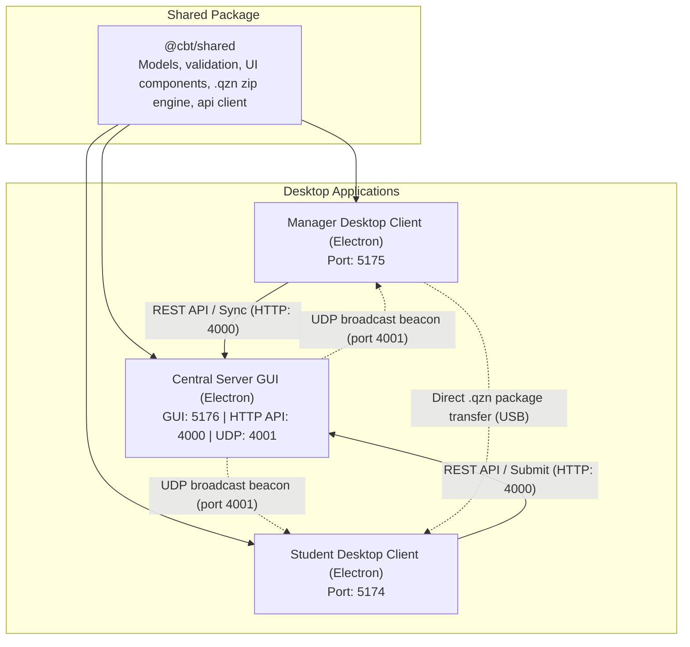

# System architecture and design

This document describes the technical architecture, operational topology, and engineering design patterns of the Quizeen CBT platform.

## System topology

## Architectural principles

### 1. Offline-first local execution
School computer laboratories frequently operate in bandwidth-constrained or air-gapped environments. Quizeen operates without continuous network connectivity:
- The Manager compiles assessments into standalone `.qzn` archives.
- The Student client imports packages into local storage.
- All candidate responses and timing data persist locally as the examination progresses.
- Completed submissions can sync over local Wi-Fi or Ethernet to the central server, or export to USB media.

### 2. Desktop architecture across all three applications
All three components (Manager, Student, and Server) run as dedicated Electron applications:
- **Manager**: Authoring, class analytics, score compilation, and offline packaging.
- **Student**: Fullscreen examination runner with focus violation tracking and built-in calculator.
- **Server**: Express engine wrapped in an Electron interface with live request monitoring, network IP reporting, auto-start controls, and shutdown warnings to prevent accidental exam interruptions.

### 3. Automatic local network discovery
The platform features zero-configuration server discovery for local area networks:
- The Server broadcasts lightweight UDP discovery packets on port 4001 every two seconds when active.
- Manager and Student desktop clients listen for these beacons and automatically identify the server IP and port.
- Clients also support manual IP configuration and live connection testing in their settings modals.

### 4. Monorepo code sharing
A single shared package (`@cbt/shared`) houses entity definitions, UI building blocks, zip compilers, and network client utilities. All applications reference this common package, eliminating schema drift between authoring, examination, and grading.

### 5. Electron IPC boundaries
Desktop applications wrap the frontend in an Electron container with strict security configurations:
- `nodeIntegration: false` and `contextIsolation: true` isolate the renderer from direct Node execution.
- System actions (storage access, window controls, and discovery events) communicate through typed context bridges in `preload.ts`.
- The custom TitleBar integrates with window state handlers to support frameless windows.

### 6. Integrity and focus monitoring
During an active assessment, the client runs focus detection routines:
- `document.onvisibilitychange` and `window.onblur` track when the candidate switches applications or minimizes the window.
- The exam runner increments an internal counter (`windowSwitchCount`) each time the window loses focus.
- The counter is embedded into the submitted payload so teachers can review test integrity during grading.
