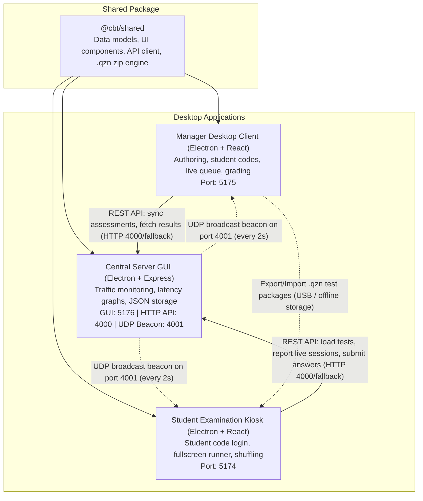
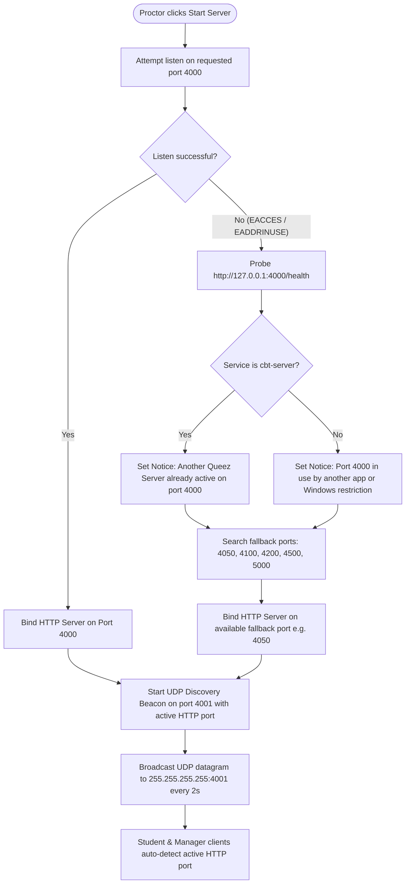
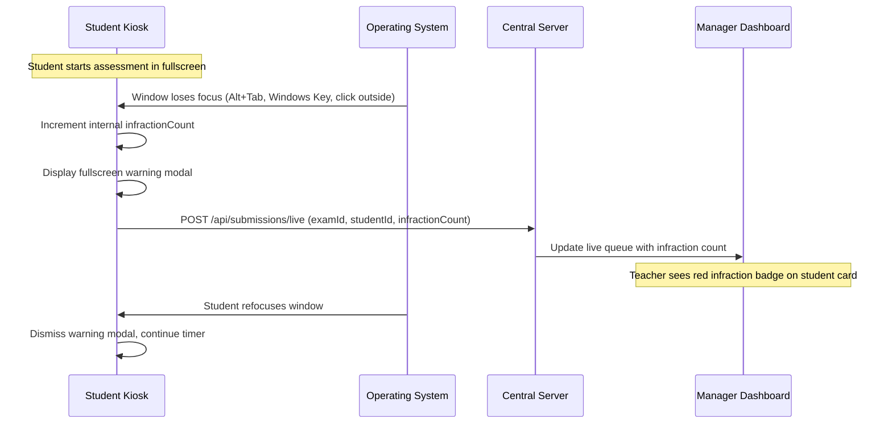

# System Architecture and Design

This document describes the technical architecture, operational topology, networking protocols, security controls, and design patterns of the Quizeen Computer-Based Testing (CBT) suite.

---

## 1. Architectural Overview and Philosophy

Quizeen CBT operates as a local-first, client-server examination platform built specifically for schools and institutional testing environments. School computer laboratories often face intermittent network connections, air-gapped workstations, and strict administrative permissions on Windows operating systems. The platform design directly reflects these practical constraints through four core principles:

1. **Local Area Network (LAN) Independence**:
   The entire suite runs locally within the school facility. It does not require an active internet connection, cloud servers, or external software dependencies. All test authoring, student verification, live session monitoring, and score computation happen inside the school building.

2. **Zero-Configuration Network Discovery**:
   Setting up testing rooms must not require manual IP address configuration on dozens of student workstations. The Central Server advertises its network coordinates using local UDP broadcast beacons, allowing Student stations and Manager workstations to connect automatically.

3. **Resilient Local Persistence with Air-Gap Support**:
   While the client-server mode over LAN is the primary operating topology, the system provides offline archive packaging (.qzn files) as a full fallback. Tests can be compiled into encrypted archive files in the Manager app, transferred to student terminals using USB flash drives, and imported directly on stations that lack network wiring.

4. **Modular Architecture with Strict Size Limits**:
   Every TypeScript and React file in the codebase adheres to a strict maximum limit of 99 lines. Complex features are divided into single-purpose components, specialized custom hooks, and isolated utility modules.

---

## 2. System Topology and Component Layout



### Component Roles

#### A. Central Server (`apps/server`)
The Central Server is the coordination hub for the examination room. It combines a Node.js Express REST API with an Electron desktop graphical user interface. Proctors use the server interface to start or pause the service, monitor incoming network traffic, observe latency graphs, and inspect live request logs.

The server hosts the primary JSON document database, handles idempotent test submissions, computes scores, and manages student code lookups.

#### B. Assessment Manager (`apps/manager`)
The Assessment Manager is the administrative workstation application used by teachers, subject heads, and exam administrators. It provides:
- Test authoring tools with rich text question prompts, multiple-choice options, true or false questions, and point distributions.
- Assessment scheduling, duration limits, passing scores, unlock PINs, and random shuffling toggles.
- Student candidate management with automatic generation of unique 6-character access codes.
- A live examination monitoring board that displays candidates currently taking tests, remaining time, and real-time window switch warnings.
- A grading queue for evaluating short-answer or essay questions and adjusting final scores.
- Comprehensive class performance analytics with grade breakdowns (A through F) and subject-by-subject rosters.
- Two-way `.qzn` package support for compiling offline test archives and loading externally generated packages directly into the central server database.

#### C. Student Examination Station (`apps/student`)
The Student Examination Station is the client used by examinees. It runs either as an Electron desktop application in kiosk mode or within a modern web browser. Key features include:
- Candidate authentication using a 6-character student code issued by the teacher.
- A dynamic assessment catalog filtered to the student's assigned level, class, and department.
- A fullscreen exam runner with a countdown timer, navigation grid, and on-demand scientific calculator.
- Candidate-specific question and option shuffling to discourage screen copying in crowded rooms.
- Continuous window focus tracking that detects application switching and reports infraction counts to the server in real time.
- Resilient local caching that allows students to continue working without interruption if the local Wi-Fi or Ethernet cable disconnects temporarily.

#### D. Shared Package (`packages/shared`)
The `@cbt/shared` library houses shared TypeScript contracts, UI design system components, date formatting utilities, the HTTP API client, and the `.qzn` archive compiler and extractor. Referencing this shared module across all applications guarantees data consistency between authoring, examination, and scoring.

---

## 3. Network Architecture and Protocols

The CBT suite uses two distinct network communication layers:

```
+-------------------------------------------------------------------------+
|                               Local Network                             |
|                                                                         |
|   +-------------------+                     +-----------------------+   |
|   |  Central Server   |                     |   Student / Manager   |   |
|   |                   |                     |                       |   |
|   |   HTTP Port: 4000 | <== REST Requests = |   HTTP API Client     |   |
|   |   (or 4050, 4100) | = Direct Responses> |                       |   |
|   |                   |                     |                       |   |
|   |   UDP Port: 4001  | --- Broadcast ----> |   Discovery Listener  |   |
|   |   (Discovery)     |     (Every 2s)      |   (Listens on 4001)   |   |
|   +-------------------+                     +-----------------------+   |
+-------------------------------------------------------------------------+
```

### 3.1. Primary HTTP REST API (Port 4000 with Dynamic Fallback)

All operational data exchanges (fetching assessments, submitting answers, streaming live session heartbeats, and retrieving student codes) take place over HTTP/1.1 REST endpoints using JSON payloads.

#### Default Port and Port Fallback Strategy
By default, the server binds to TCP port `4000` on all local network interfaces (`0.0.0.0`). However, on Windows systems, port 4000 can become unavailable due to two common conditions:
1. Another process is already using port 4000 (such as a previous server instance or another local tool).
2. Windows reserved port exclusions. Windows features like Hyper-V, Windows Subsystem for Linux (WSL), and WinNAT dynamically reserve blocks of TCP ports. When port 4000 falls within one of these reserved blocks, Windows denies binding permission, returning error `WSAEACCES 10013` (`listen EACCES: permission denied 0.0.0.0:4000`).

To ensure continuous operation without manual user troubleshooting, the server implements an automated port fallback engine in `apps/server/electron/port-fallback.ts`:

1. The server attempts to bind to the requested port (default 4000).
2. If binding fails with `EACCES` or `EADDRINUSE`, the server queries its candidate fallback list: `[4050, 4100, 4200, 4500, 5000, 5050, 8080]`.
3. Port 4001 is strictly excluded from HTTP fallback candidates because it is reserved for the UDP discovery beacon.
4. The server selects the first verified available port, starts the HTTP listener, and immediately updates its UDP discovery beacon.
5. Client applications on the network receive the updated port from the beacon and connect without requiring manual settings adjustments.

#### Active Server vs Foreign Port Conflict Detection
When port 4000 cannot be bound, the server manager probes `http://127.0.0.1:4000/health` to identify the reason:
- If the probe returns `{ "status": "ok", "service": "cbt-server" }`, the system recognizes that another instance of Quizeen Server is already running. The UI notifies the operator:
  `Another Queez Server is already active on port 4000. Started on fallback port 4050.`
- If the probe fails, times out, or returns foreign data, the system identifies that a non-Queez application or a Windows port exclusion is blocking the port. The UI reports:
  `Port 4000 is in use by another app or restricted by Windows. Started on fallback port 4050.`



### 3.2. Background UDP Discovery Beacon (Port 4001)

To achieve zero-configuration networking, the Central Server includes a UDP beacon transmitter (`ServerBeacon` in `apps/server/electron/discovery.ts`):

- While the HTTP server is running, the beacon broadcasts a lightweight UDP datagram to the subnet broadcast address (`255.255.255.255`) on port `4001` every 2000 milliseconds.
- The beacon payload contains:
  ```json
  {
    "service": "quizeen-cbt-server",
    "ips": ["192.168.1.120", "10.0.0.45"],
    "primaryIp": "192.168.1.120",
    "port": 4000,
    "timestamp": 1789396200000
  }
  ```
- Both the Student client (`apps/student/electron/discovery-listener.ts`) and Manager client (`apps/manager/electron/discovery-listener.ts`) bind to UDP port `4001` with `reuseAddr: true`.
- When a beacon datagram arrives, the client verifies that `service === "quizeen-cbt-server"`, extracts the IP and active port, and automatically sets the server URL in client state.
- In environments where UDP broadcast packets are filtered by network switches or Wi-Fi access point isolation, both Manager and Student include a manual connection configuration dialog with an integrated health test button (`GET /health`).

---

## 4. Assessment Shuffling and Question Randomization

In computer labs where students sit closely side by side, preventing visual copying is a primary security requirement. Quizeen implements a deterministic, candidate-seeded pseudo-random shuffling engine in `apps/student/src/features/runner/runnerShuffleHelper.ts`.

### 4.1. Shuffling Configuration
Test authors configure shuffling rules inside the Assessment Manager:
- `shuffleQuestions` (boolean): When enabled, each student receives the test questions in a unique sequence.
- `shuffleOptions` (boolean): When enabled, the multiple-choice options within each question appear in a randomized order for each student.

### 4.2. Deterministic Candidate Seeding
To maintain fairness and auditability, shuffling must never be completely random. If a student's computer restarts or the browser tab refreshes mid-test, the student must return to the exact same question order and option choices they saw previously.

The shuffling algorithm uses a pseudo-random number generator (PRNG) seeded by the candidate's unique identity:
1. The seed string is derived from the candidate session: `candidateCode + "_" + assessmentId`.
2. A 32-bit hash of this string initializes the Linear Congruential Generator (LCG).
3. The array of questions is shuffled using the Fisher-Yates algorithm driven by this seeded PRNG.
4. If option shuffling is active, the options array of each individual question is shuffled using a secondary seed derived from the question identifier and candidate seed.

### 4.3. Preserving Answer Key Scoring Accuracy
Shuffling creates a presentation layer on top of the canonical data model:
- The question's canonical `id` and each option's textual string value remain unchanged.
- When the student selects an option, the submission engine records the selected string value rather than a position index (such as option 0 or option A).
- When the server scores the submission, it evaluates the selected string directly against the canonical `Question.correctAnswer`.
- This ensures 100% scoring precision regardless of how the options were visually rearranged on the student's screen.

---

## 5. Offline .qzn Package Engine

For computer labs without a local network, Quizeen supports an offline package distribution format (`.qzn`):

```
+-------------------------------------------------------------+
|                     .qzn Archive Structure                  |
|                                                             |
|   ├── manifest.json      # Package metadata, version, hash  |
|   ├── assessment.json    # Complete assessment definition   |
|   └── assets/            # Embedded images and media files  |
+-------------------------------------------------------------+
```

### 5.1. Archive Compilation
When a teacher selects "Export Package (.qzn)" in the Manager:
1. The compiler (`packages/shared/src/storage/package-compiler.ts`) packages the assessment schema into an uncompressed or compressed zip archive using `JSZip`.
2. A cryptographic SHA-256 hash of the assessment data is calculated and stored in `manifest.json`.
3. The file is saved with the `.qzn` extension.

### 5.2. Two-Way Package Handling

#### Manager Package Loader (`QznLoaderModal.tsx`)
Teachers can import `.qzn` files directly into the Assessment Manager. The loader validates the archive structure, unpacks the assessment definition, marks it active and published, and posts it to the Central Server database. This allows schools to author tests on a home computer, copy the `.qzn` file to a USB drive, and import it into the school's central server on exam day.

#### Student Station Package Loader
On isolated student terminals without network access, proctors can open the station settings modal and load a `.qzn` file from a USB drive:
- The student application extracts the archive and saves the assessment into local IndexedDB storage.
- The station synchronization logic (`studentStoreSync.ts`) performs an ID-based merge rather than a destructive wipe. This ensures that locally imported `.qzn` packages remain visible in the catalog even when the station connects to a server.
- If the station later connects to a Central Server, it offers to push the locally imported test to the central database.

---

## 6. Embedded Database and Storage Management

The Central Server persists data without external database engines. It uses an embedded, file-based JSON document store with in-memory caching.

### 6.1. File System Partitioning

Records are organized into distinct folders under the data directory:

```
data/
├── assessments/
│   ├── exam_17892348912.json
│   └── exam_sss2_physics.json
├── students/
│   ├── primary.json
│   ├── junior.json
│   ├── senior.json
│   └── general.json
└── submissions/
    ├── exam_17892348912.json
    └── exam_sss2_physics.json
```

- **Assessments (`data/assessments/[id].json`)**: Each test is stored in an independent file. Creating or editing an exam modifies only that file.
- **Students (`data/students/[category].json`)**: Candidates are partitioned by educational level (`primary`, `junior`, `senior`, `general`). This prevents candidate lists from growing into unwieldy monolithic files.
- **Submissions (`data/submissions/[examId].json`)**: Submissions are grouped by examination identifier. When grading a specific test, the server reads only the submission file for that exam.

### 6.2. In-Memory Caching and Write-Through Persistence
- On server startup, the database loader reads all JSON files into memory (`Map<string, T>`).
- All read operations (`getAll`, `getById`, `getByCode`) are served directly from memory in constant time O(1).
- Mutation operations (`create`, `update`, `delete`) update the memory cache and execute a synchronous write (`fs.writeFileSync`) to the target JSON file.

### 6.3. Windows ProgramData Storage and Permissions
When applications are installed in `C:\Program Files` on Windows, standard user accounts do not possess write permissions to that directory. Attempting to write JSON files to `C:\Program Files\Queez CBT Suite\data` results in `EACCES: permission denied`.

To prevent this issue, the server resolves its data directory using the following hierarchy (`apps/server/src/core/db/database.ts`):
1. `process.env.QUEEZ_DATA_DIR` if explicitly defined.
2. In development mode: local project paths (`apps/server/data`, `data`, or `../data`).
3. In production mode on Windows: `%PROGRAMDATA%\Queez CBT Suite\data`.
4. Fallback: `%APPDATA%\Queez CBT Suite\data`.

During installation, the NSIS installer executes Windows access control commands (`icacls`) to grant full modify permissions (`Users:(OI)(CI)M`) to the `%PROGRAMDATA%\Queez CBT Suite\data` directory, guaranteeing that any standard Windows account can run the server without administrative elevation.

---

## 7. Real-Time Integrity and Focus Monitoring

To preserve testing integrity, the student client monitors window focus and application switching throughout the examination:



1. **Detection**:
   The exam runner attaches listeners to `window.onblur` and `document.onvisibilitychange`. If the candidate presses Alt+Tab, hits the Windows key, or interacts with another application, the event fires immediately.

2. **Immediate Local Feedback**:
   The runner increments the student's `infractionCount` and displays an on-screen warning alert indicating that leaving the exam window is prohibited.

3. **Live Server Sync**:
   The runner transmits the updated count immediately to the server via `POST /api/submissions/live`. The Central Server updates the active session record.

4. **Proctor Visibility**:
   The Manager live marking queue displays an infraction badge next to the student's name in real time, allowing proctors to intervene during the exam.

5. **Submission Record**:
   When the student submits their final paper, the total `infractionCount` is stored as a permanent property of the completed submission object for review during final grading.

---

## 8. Electron IPC and Security Architecture

All three applications use Electron with hardened security configurations:

### 8.1. Process Isolation
Every `BrowserWindow` instance enforces process boundaries:
```typescript
webPreferences: {
  nodeIntegration: false,
  contextIsolation: true,
  preload: path.join(__dirname, 'preload.js')
}
```
The renderer process (React UI) cannot access Node.js APIs, file system modules, or operating system primitives directly.

### 8.2. Typed Preload Bridges
Communication between the UI renderer and the main Electron process occurs exclusively through typed context bridges:
- `window.electronApi`: Window control actions (minimize, maximize, close, fullscreen toggle).
- `window.serverApi`: Server control actions (startServer, stopServer, getStatus, detectExisting).
- `window.discoveryApi`: Network discovery events for listening to UDP beacons.

### 8.3. Custom Frameless Titlebar
All applications use frameless windows (`frame: false` or `titleBarStyle: 'hidden'`) with custom HTML title bars (`TitleBar` from `@cbt/shared`). The title bar integrates with `useTitleBar` to respond to window maximize, unmaximize, minimize, and close events.

---

## 9. Monorepo Organization and Coding Constraints

### 9.1. Workspace Structure
The repository is managed using npm workspaces:
- `apps/manager`: React 18, Vite, Electron, CSS Modules.
- `apps/student`: React 18, Vite, Electron, IndexedDB, CSS Modules.
- `apps/server`: React 18 (GUI), Express (API), Node.js, Electron.
- `packages/shared`: Shared TypeScript types, UI components, API wrappers.

### 9.2. Strict File Size Constraint
All source code files (`.ts`, `.tsx`, and `.css`) are strictly limited to less than 100 lines (maximum 99 lines). When a component or utility approaches this limit, it must be decomposed into sub-components or extracted into helper functions. Documentation files (`.md`) are exempt from this limit.

### 9.3. Code Quality Constraints
- Zero emojis anywhere in source code, user interface text, commit messages, and documentation.
- Zero em dashes (avoiding both Unicode em dashes and double-hyphen substitutes). Punctuation relies on commas, parentheses, colons, or clean sentence divisions.
- Plain, direct, concise language across all user-facing notifications and error dialogs.
