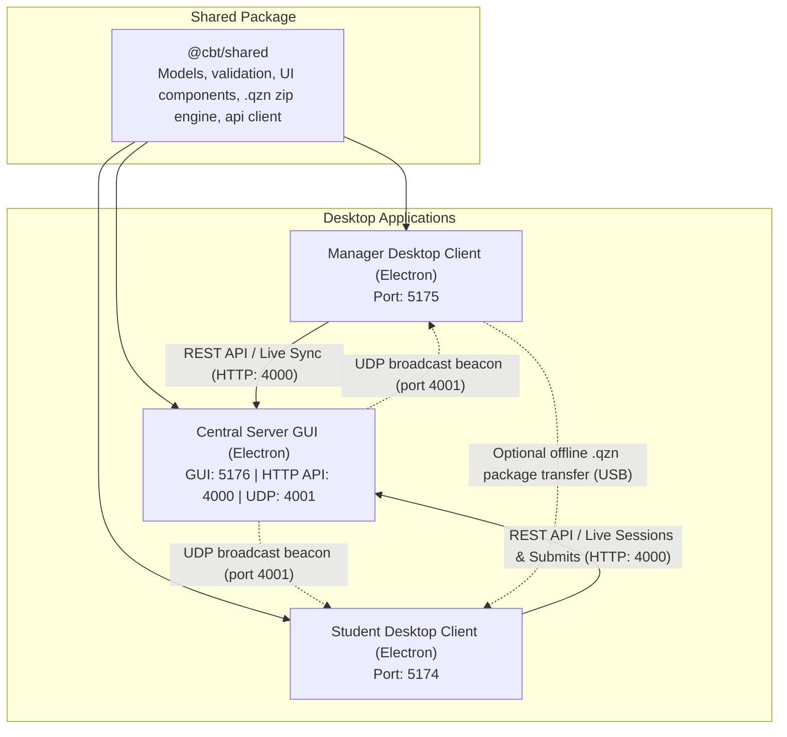

# System architecture and design

This document describes the technical architecture, operational topology, and engineering design patterns of the Quizeen CBT platform.

## System topology

## Architectural principles

### 1. Centralized local network (LAN) architecture with offline fallback
The standard operating mode connects Manager and Student applications to the Central Server over a local area network (LAN, Wi-Fi, or Ethernet):
- The Central Server provides real-time REST API endpoints for publishing assessments, registering student codes, monitoring live test sessions, reporting infractions, and grading submissions.
- Continuous auto-sync: Manager and Student clients sync data automatically in the background, on window focus, and via manual refresh buttons.
- Mutating request idempotency: All create, update, and delete requests use idempotency keys and payload hashes to guarantee safe retries without duplicate records.
- Optional offline package fallback: In fully air-gapped classrooms without a local network, Manager can export assessments into encrypted `.qzn` archives for direct USB transfer to student terminals.

### 2. Desktop architecture across all three applications
All three components (Manager, Student, and Server) run as dedicated Electron applications:
- **Manager**: Test authoring, student code generation, live marking queue, score analytics, and optional offline packaging.
- **Student**: Fullscreen test runner, Student ID login, built-in calculator, and real-time infraction sync.
- **Server**: Express REST engine wrapped in an Electron desktop interface with real-time request logging, network adapter IP display, auto-start controls, and shutdown confirmation warnings.

### 3. Automatic local network discovery
The platform features zero-configuration server discovery for local area networks:
- The Server broadcasts lightweight UDP discovery packets on port 4001 every two seconds when active.
- Manager and Student desktop clients listen for these beacons and automatically identify the server IP and port.
- Clients also support manual IP configuration and live connection testing in their settings modals.

### 4. Monorepo code sharing
A single shared package (`@cbt/shared`) houses entity definitions, UI building blocks, zip compilers, and network client utilities. All applications reference this common package, eliminating schema drift between authoring, examination, and grading.

### 5. Electron IPC boundaries
Desktop applications wrap the frontend in an Electron container with strict security configurations:
- `nodeIntegration: false` and `contextIsolation: true` isolate the renderer from direct Node execution.
- System actions (storage access, window controls, and discovery events) communicate through typed context bridges in `preload.ts`.
- The custom TitleBar integrates with window state handlers to support frameless windows.

### 6. Real-time integrity and focus monitoring
During an active assessment, the client runs continuous focus detection routines:
- `document.onvisibilitychange` and `window.onblur` track when the candidate switches applications, changes tabs, or minimizes the window.
- The exam runner increments an internal counter (`infractionCount`) each time the window loses focus.
- The runner immediately reports the updated count to the Central Server via `POST /api/submissions/live`, allowing teachers to view active app switches in the Manager live queue while the test is underway.
- The finalized count is saved into the completed submission record for review during grading.

### 7. Categorized data storage architecture
The server persists records using an embedded, file-based JSON store split across domain-specific directories under `data/`:
- `data/assessments/[id].json`: Each assessment resides in an isolated file.
- `data/students/[category].json`: Student records are partitioned by level (`primary`, `junior`, `senior`, `general`).
- `data/submissions/[examId].json`: Candidate submissions are grouped per exam.
- In-memory caching (`Map<string, T>`) provides instant reads during test sessions, while write-through logic saves changes immediately to disk.

For full technical specifications, see [Database architecture and storage management](DATABASE.md).

