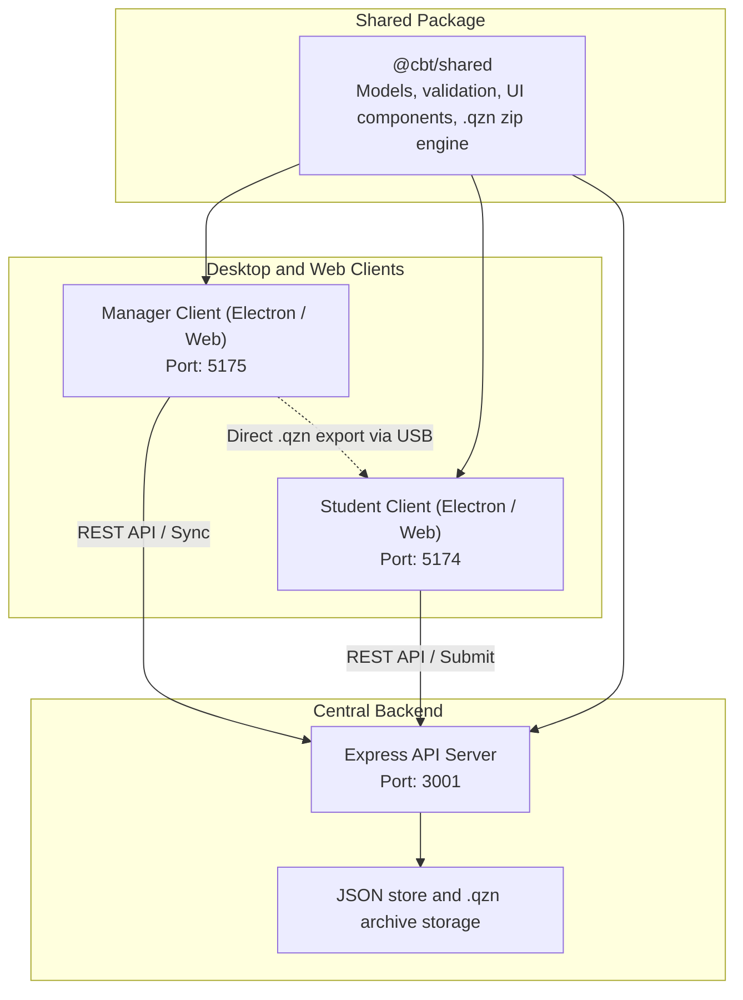

# System architecture and design

This document describes the technical architecture, operational topology, and engineering design patterns of the Quizeen CBT platform.

## System topology

## Architectural principles

### 1. Offline-first local execution
School computer laboratories frequently operate in bandwidth-constrained or air-gapped environments. Quizeen operates without continuous network connectivity:
- The Manager compiles assessments into encrypted `.qzn` archives.
- The Student client imports packages into browser or Electron local storage.
- All candidate responses and timing data persist to disk as the exam progresses.
- Completed submissions can be synced back over a local network or exported to USB media.

### 2. Monorepo code sharing
A single shared package (`@cbt/shared`) houses all entity definitions, UI building blocks, zip compilers, and grading logic. Both desktop applications and the backend server reference this common package, eliminating schema drift between authoring, examination, and grading.

### 3. Electron IPC boundaries
Desktop applications wrap the Vite frontend in an Electron container with strict security settings:
- `nodeIntegration: false` and `contextIsolation: true` prevent direct node execution in the UI context.
- Native capabilities (local file storage, window controls, and title bar height configuration) travel through a typed bridge in `preload.ts`.
- The `useTitleBar` hook adapts the custom title bar based on window maximize state.

### 4. Integrity and focus monitoring
During an active assessment, the client runs focus detection routines:
- `document.onvisibilitychange` and `window.onblur` track when the candidate switches applications or minimizes the window.
- The exam runner increments an internal counter (`windowSwitchCount`) each time the window loses focus.
- The counter is embedded into the submitted payload so teachers can review test integrity during grading.
