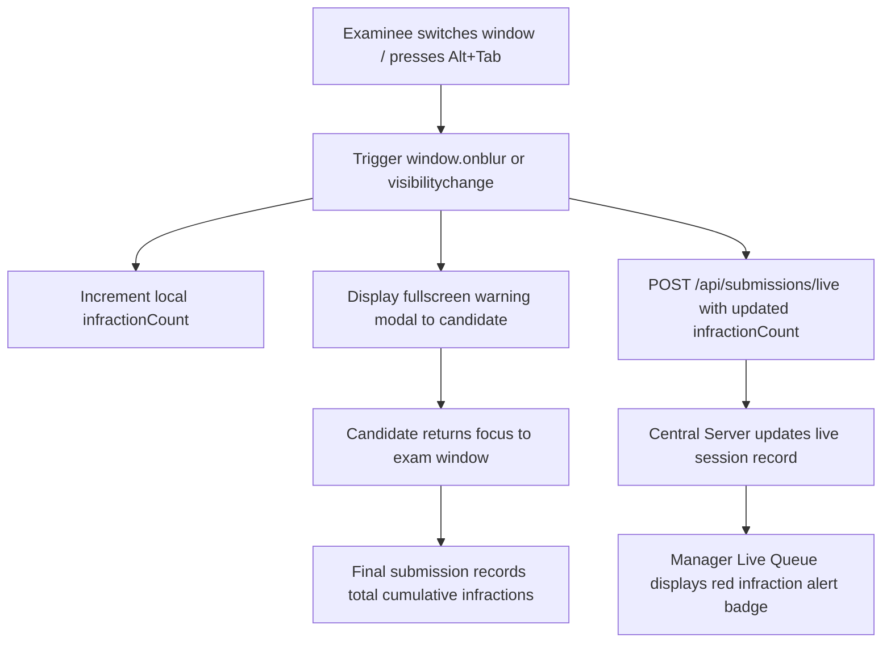

# Security Architecture, Anti-Cheat Controls, and Disclosure Policy

This document defines the security boundaries, anti-cheat mechanisms, operating system permission handling, and vulnerability disclosure policies for the Quizeen CBT suite.

---

## 1. Electron Process Isolation and IPC Security

All three desktop applications (Central Server, Assessment Manager, and Student Station) execute within Electron containers adhering to strict process boundary rules:

### 1.1. Context Isolation and Node Integration
Every `BrowserWindow` instance enforces the following security properties:
```typescript
webPreferences: {
  nodeIntegration: false,
  contextIsolation: true,
  sandbox: true,
  preload: path.join(__dirname, 'preload.js')
}
```

- **`nodeIntegration: false`**: Prevents client-side scripts from accessing Node.js runtime APIs, file system modules (`fs`), or process execution modules (`child_process`).
- **`contextIsolation: true`**: Guarantees that the renderer execution context and preload script execution context remain isolated from one another, preventing prototype pollution attacks from compromising main process bridges.
- **Strict Preload Bridges**: The renderer accesses operating system features solely through explicitly exposed, typed functions in `preload.ts` using `contextBridge.exposeInMainWorld()`.

### 1.2. Protocol and Navigation Restrictions
- External URL navigation within the Electron window is blocked.
- New window creation (`window.open` or `<a target="_blank">`) is intercepted and denied by `setWindowOpenHandler` listeners.
- DevTools access is disabled in production builds.

---

## 2. Examination Integrity and Anti-Cheat Controls

In school computer laboratories where workstations are placed in close proximity, visual copying and application switching represent the primary threat vectors. Quizeen implements multi-layered integrity defenses:

### 2.1. Window Focus and Application Switch Tracking
During an active exam session, the Student Station monitors window visibility and operating system focus:



1. **Blur Detection**: Listeners attach to `window.onblur` and `document.onvisibilitychange`. If the candidate presses Alt+Tab, hits the Windows key, or clicks outside the kiosk, the blur handler executes immediately.
2. **Immediate Warning**: A modal alert covers the examination screen, informing the student that leaving the window is prohibited and has been recorded.
3. **Live Infraction Streaming**: The runner increments `infractionCount` and immediately sends a heartbeat payload to `POST /api/submissions/live`.
4. **Proctor Real-Time Notification**: The Assessment Manager's live queue displays an infraction badge next to the student's name in red, alerting proctors to intervene.
5. **Permanent Submission Audit**: When the assessment is completed, the cumulative `infractionCount` is stored as an immutable property in the final submission record for post-exam review.

### 2.2. Deterministic Candidate-Seeded Shuffling
To eliminate visual copying between adjacent screens, the examination engine randomizes question and option orders:

1. **Deterministic Seed Derivation**:
   A candidate-specific seed is computed: `studentCode + "_" + assessmentId`.
2. **Fisher-Yates PRNG**:
   A Linear Congruential Generator (LCG) seeded with the candidate hash drives the Fisher-Yates shuffle algorithm. If the application restarts, the student receives the exact same question order and option choices.
3. **Answer Key Protection**:
   Shuffling reorders the visual presentation choices without altering canonical question IDs or option text strings. Submissions record textual selections rather than positional indices, maintaining 100% scoring precision.

---

## 3. Windows Permissions and Storage Security

### 3.1. Mitigating Program Files Permission Conflicts
Standard Windows user accounts cannot write to `C:\Program Files\`. When Quizeen is installed for all users, running the server as a normal user previously caused `EACCES: permission denied` errors when creating database files.

### 3.2. ProgramData Isolation and Access Control (`icacls`)
The storage engine stores all persistent data in `%PROGRAMDATA%\Queez CBT Suite\data` rather than `Program Files`:
- During installation, the NSIS installer executes:
  `icacls "$COMMONPROGRAMDATA\Queez CBT Suite\data" /grant "Users":(OI)(CI)M /T /C`
- This command grants modify permissions (`(OI)(CI)M`) to all standard local Windows accounts (`Users`), enabling non-administrative users to run the server, save assessments, and record submissions without UAC elevation prompts.

### 3.3. Installer Elevation Loop Prevention
When the user chooses "Install for all users" in the installer wizard:
- The installer relaunches itself with administrator privileges using the `/allusers` command line flag.
- The NSIS `.onInit` script sets a `$Relaunched` state flag upon detecting this parameter.
- The wizard automatically skips the Welcome, License, and Installation Scope pages on relaunch, jumping directly to component selection. This eliminates the infinite loop where the installer previously reset to step 1 upon elevation.

---

## 4. Network and API Security

### 4.1. Request Idempotency
To prevent duplicate submissions caused by network timeouts or repeated button clicks:
- All mutating endpoints (`POST /api/submissions`, `POST /api/assessments`) pass through idempotency middleware.
- The server computes a SHA-256 hash of the request body and endpoint.
- In-flight requests are deduplicated. Duplicate requests arriving within 10 seconds return the cached initial response with header `Idempotent-Replayed: true`.

### 4.2. Local Area Network Isolation
- The server binds strictly to local network interfaces (`0.0.0.0`) and does not establish outbound internet connections.
- CORS headers can be restricted to specific workstation IP addresses using the `CORS_ORIGIN` environment variable.

### 4.3. Offline Package Integrity (.qzn)
- `.qzn` archives include an internal `manifest.json` carrying a SHA-256 hash of the assessment payload.
- Before unpacking an archive into the active database, the extractor verifies the archive structure and checksum to guard against corrupted or tampered test files.

---

## 5. Vulnerability Reporting and Disclosure Policy

We take the security of examination records and assessment papers seriously.

### 5.1. Reporting Procedure
Do not report suspected security vulnerabilities through public GitHub issues.

To disclose an issue privately:
1. Email `security@quizeen.internal` or contact the system engineering team directly.
2. Provide a clear technical description of the vulnerability.
3. Include step-by-step reproduction instructions or a minimal proof-of-concept script.
4. Specify the affected component (Server API, Manager Desktop, Student Kiosk, or NSIS Installer).

### 5.2. Service Level Agreements (SLAs)
The engineering team assesses incoming reports according to the following schedule:
- Initial acknowledgement: within 24 hours of receipt.
- Triage and severity assessment: within 48 hours.
- Critical vulnerabilities (exam tampering, unauthenticated remote code execution): patched within 72 hours.
- High severity vulnerabilities: resolved within 7 business days.
- Medium and low severity issues: scheduled for the next regular version release.
