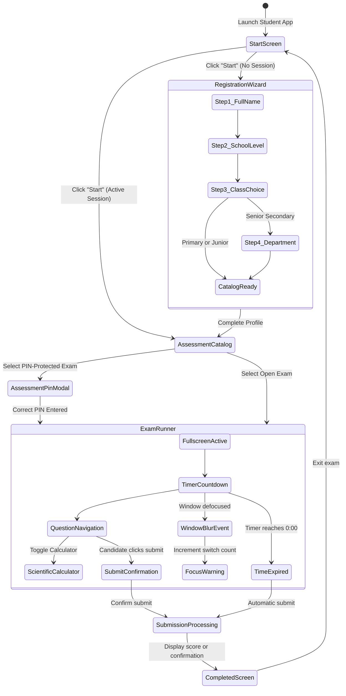
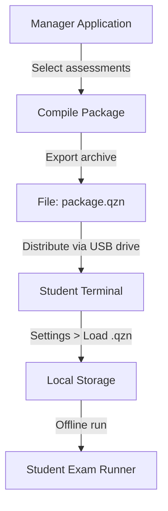

# User journeys and state transitions

This document outlines the user journeys, state transitions, and interaction paths for students and educators using the Quizeen platform.

---

## Student journey

The candidate experience follows four phases: registration, catalog selection, assessment execution, and submission.

### Stage breakdown

1. **Start and registration**:
   - First-time candidates complete a step-by-step wizard capturing full name, education level (`Primary`, `Junior Secondary`, or `Senior Secondary`), class, and optional department stream.
   - The session persists in local storage so returning students bypass the wizard directly to their class catalog.
   - Candidates can reset their active session at any point by selecting the "Leave Exam Room" button.

2. **Assessment catalog**:
   - Displays all assessments matching the student's assigned level, class, and department.
   - Checks date and time availability against `availableFrom` and `availableTo` constraints.
   - Locked exams require entering an invigilator PIN before opening.

3. **Assessment runner**:
   - The test launches in full-screen mode with an active countdown timer.
   - Candidates navigate questions sequentially or jump to questions using the question index grid.
   - A built-in scientific calculator is available as an on-demand drawer.
   - If the candidate switches windows or minimizes the application, a blur event triggers a warning and increments the `windowSwitchCount` counter.

4. **Submission and results**:
   - When time expires, answers submit automatically.
   - When submitting manually, the candidate confirms review before final grading.
   - Once submitted, completed assessments display an "Already Submitted" status and lock re-entry.

---

## Educator journey

Educators create, schedule, and curate assessment content from the Manager application.

### Assessment authoring workflow

1. **Dashboard navigation**:
   - The educator reviews the class summary list, class details, and subject-specific score sheets.
   - Clicking "Create Assessment" opens the authoring modal.

2. **Configuration tab**:
   - Defines academic parameters: subject, session, and assessment type (test vs term exam).
   - Sets target audience: school level, target classes, and department stream.
   - Configures duration in minutes and passing score percentage.
   - Sets scheduling rules: active status toggle, opening start time, and closing deadline.

3. **Questions tab**:
   - Questions appear as compact cards showing the point value and a short prompt summary.
   - Selecting "Edit Question" expands the editor in place for prompt editing and answer key adjustments.
   - Clicking "Done" collapses the card back to its compact state.
   - Selecting "Add Question" appends a new question entry in edit mode.

4. **Saving and publishing**:
   - Validates all required fields, point weights, and correct answer selections.
   - Persists the record to local storage and syncs to the central server when connected.

---

## Package compilation and distribution flow (.qzn)

For offline or air-gapped exam rooms without reliable local area network connections, assessments can be compiled into encrypted `.qzn` distribution archives.

1. **Manager compilation**:
   - The educator opens "Compile Packages (.qzn)" from the navigation menu.
   - Selects one or more assessments for inclusion.
   - Provides an archive name (for example, `First_Term_Exams.qzn`).
   - The compiler packages assessments, questions, and manifests into a single `.qzn` archive.

2. **Distribution**:
   - The generated `.qzn` file is copied onto removable storage media (such as a USB drive).
   - Transferred directly to student examination computers.

3. **Student import**:
   - On the student terminal, open "Settings" and select "Choose .qzn Package to Load".
   - The package is read, validated, and unpacked into local browser storage.
   - Candidate assessments become immediately available offline.
