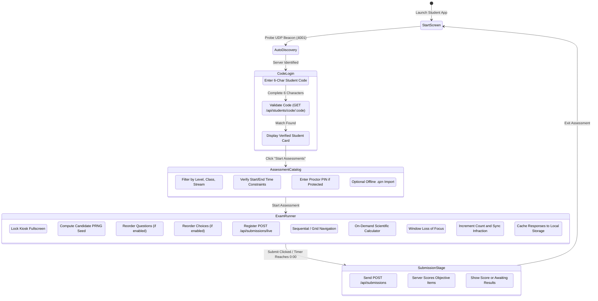
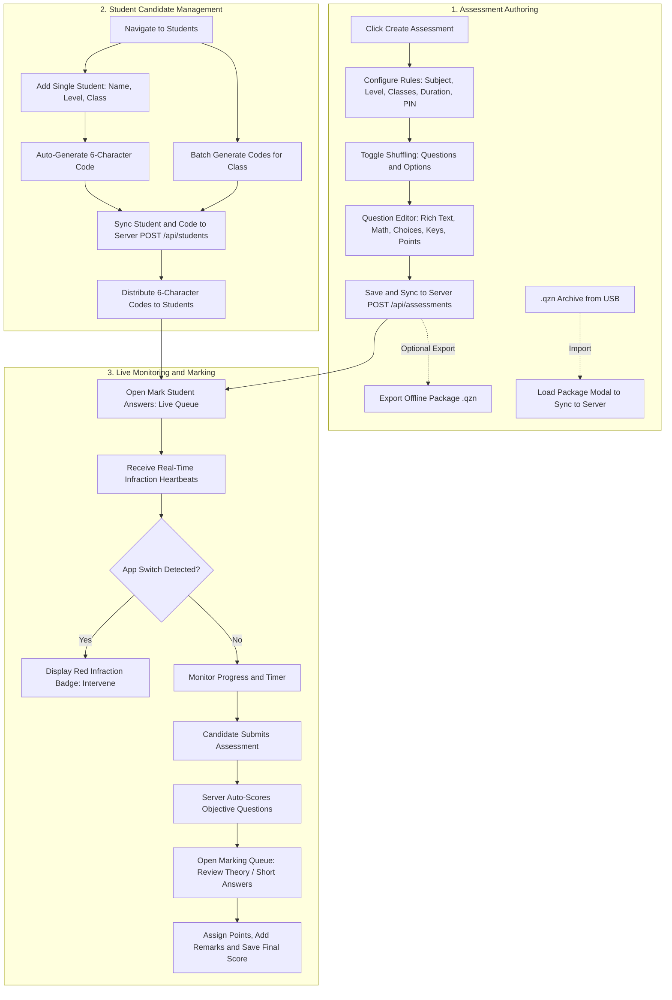
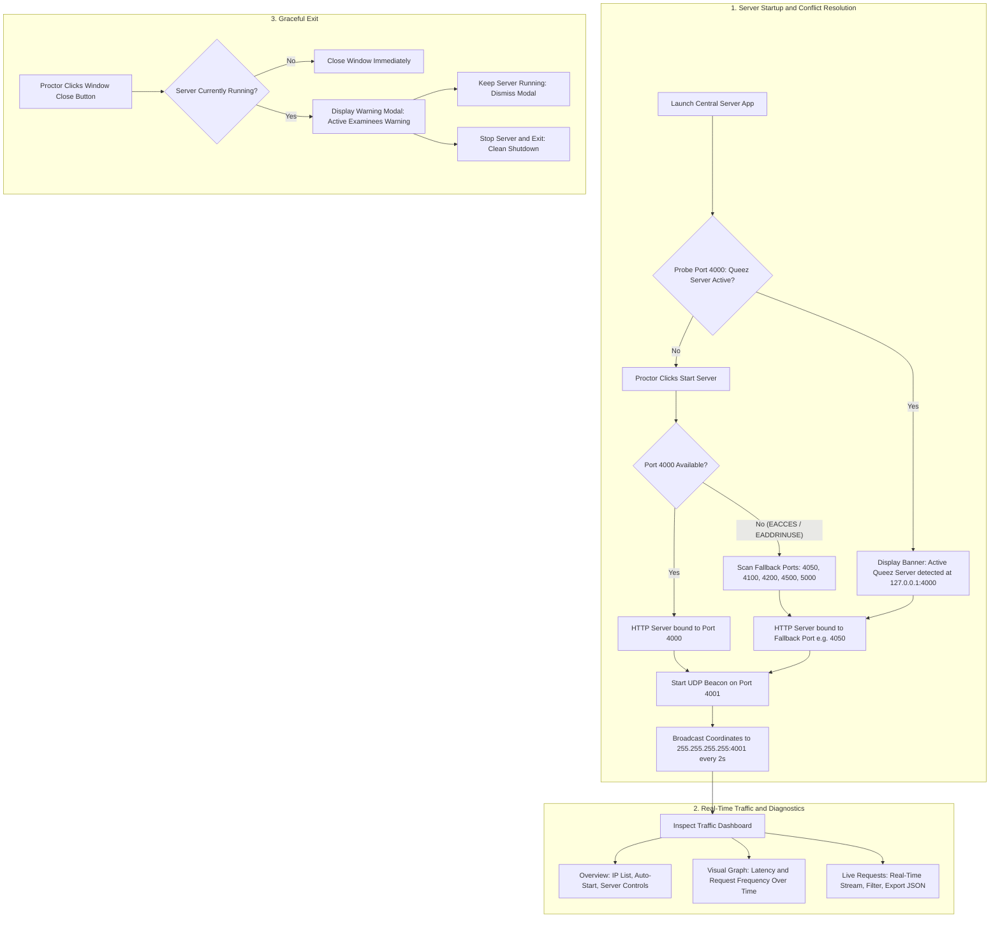

# User Journeys and Operational Workflows

This document details the end-to-end user journeys, state transitions, interaction models, and error recovery procedures across the Quizeen CBT suite.

---

## 1. Student Examination Journey

The candidate journey follows five distinct stages: station connection, authentication, catalog selection, test execution, and submission.

### Stage 1: Station Launch and Server Discovery
1. The student or proctor launches the Student client application on a workstation.
2. In the background, the application listens on UDP port 4001 for server discovery beacons.
3. Once the beacon is detected, the app automatically configures the active server URL (for example, `http://192.168.1.120:4000`).
4. If network security policies block UDP broadcasts, the user opens the Settings modal, types the server address manually, and clicks "Test Connection" to confirm connectivity.

### Stage 2: Candidate Authentication via Student ID Code
Candidates authenticate directly using their assigned 6-character Student ID code:
1. **Entering the Code**:
   - The candidate clicks "Start Exam" or "Enter Exam Room" on the start screen.
   - The application opens the Student Code Login dialog (`StudentCodeModal`).
   - The candidate inputs the 6-character alphanumeric code provided by their instructor (for example, `K7M9P2`) into the OTP-style input field.
2. **Server Verification**:
   - Upon entering the sixth character, the client queries `GET /api/students/code/:code`.
   - On a successful match, the server returns the student's full name, assigned educational level, class cohort, and department stream.
   - The modal displays the verified candidate profile card (`StudentVerifiedCard`) for student confirmation.
   - If the code is not recognized, an alert advises the student to verify their code with the proctor.
3. **Session Initialization**:
   - The candidate clicks "Start Assessments" to open their personalized assessment catalog.
   - The active session persists locally so examinees can navigate between assigned papers.
   - Candidates can log out and clear station state at any time using the "Leave Exam Room" button.

### Stage 3: Assessment Catalog
The catalog lists available assessments matching the candidate's profile:
1. **Filtering**: The view displays only assessments assigned to the student's school level and class group.
2. **Availability Windows**: The client compares current time against `availableFrom` and `availableTo` constraints. Tests outside their scheduled window appear disabled.
3. **PIN Protection**: If an exam requires an invigilator PIN, clicking the exam opens a modal prompting for the 4-digit code. The client validates the PIN via `POST /api/assessments/:id/verify-pin`.
4. **Offline Packages (.qzn)**: For air-gapped rooms, the proctor can open Settings and import a `.qzn` archive from a USB drive. The application unpacks the test and merges it into the local catalog without wiping existing tests.

### Stage 4: Assessment Runner and Anti-Cheat Monitoring
1. **Kiosk Fullscreen**: The runner expands to full screen to minimize visual distractions.
2. **Deterministic Shuffling**:
   - The runner derives a unique seed: `candidateCode + "_" + assessmentId`.
   - If `shuffleQuestions` is enabled, the questions array is shuffled using a seeded PRNG.
   - If `shuffleOptions` is enabled, multiple-choice choices within each question are shuffled using a secondary seed.
   - The student's question and option sequences differ from adjacent workstations, but the underlying question IDs and option string values remain intact.
3. **Live Session Heartbeat**:
   - On start, the runner sends `POST /api/submissions/live` to register the active session on the central server.
4. **Navigation and Tools**:
   - Candidates move through questions sequentially or jump directly using the question index grid.
   - An integrated scientific calculator is accessible in a slide-out drawer for mathematics and science examinations.
5. **Window Focus and Blur Tracking**:
   - If the examinee switches windows (Alt+Tab), hits the Windows key, or clicks outside the kiosk, a blur event triggers.
   - The runner displays an alert dialog warning the candidate that leaving the exam window is recorded.
   - The runner increments `infractionCount` and immediately transmits the updated count to the Central Server via `POST /api/submissions/live`.
   - The teacher's live marking queue displays a red warning badge with the infraction count.
6. **Local Auto-Save**:
   - Every answer selection saves to local IndexedDB storage instantly. If the local network drops or power fluctuates, no answers are lost.

### Stage 5: Submission and Scoring
1. **Submission Trigger**:
   - Manual submission: The candidate clicks "Submit Assessment", reviews their answered questions summary, and confirms.
   - Automatic submission: When the countdown timer reaches 0:00, the runner locks input and submits answers immediately.
2. **Idempotency and Server Scoring**:
   - The runner posts the payload to `POST /api/submissions` with an idempotency key.
   - The server evaluates objective questions against canonical answer keys.
   - Points are summed, percentages computed, and results persisted to `data/submissions/[examId].json`.
3. **Completion Display**:
   - If objective grading is set to automatic, the candidate views their final score and percentage.
   - If the exam contains essay questions or manual review is required, the screen reports that answers were submitted and are awaiting teacher grading.
   - Completed tests in the catalog display a permanent "Already Submitted" badge to prevent duplicate attempts.

---

## 2. Educator and Administrator Journey (Manager App)

Educators author assessments, manage student candidate rosters, monitor live testing sessions, and grade student submissions.

### Workflow 1: Assessment Authoring
1. **Initiation**: The teacher clicks "Create Assessment" on the top navigation bar.
2. **Settings and Rules**:
   - Inputs subject, session, and assessment category (Periodic Test or Major Exam).
   - Selects target educational level, specific classes, and optional department stream.
   - Sets duration in minutes and passing percentage.
   - Configures availability: active toggle, opening date/time, and closing deadline.
   - Sets invigilator unlock PIN if required.
   - Configures anti-cheat shuffling: enables "Shuffle Question Order" and "Shuffle Option Choices".
3. **Question Editor**:
   - Clicks "Add Question" to insert a question.
   - Formats rich text prompt and math formulas in the text editor.
   - Selects format (Multiple Choice, True/False, Short Answer).
   - Provides option text, selects the correct answer radio button, and assigns point weights.
   - Clicks "Done" to collapse the card into a compact preview item.
4. **Saving and Publishing**:
   - Clicks "Save Assessment". The manager saves the paper locally and synchronizes it to the Central Server (`POST /api/assessments`).

### Workflow 2: Student Candidate Management
1. **Single Candidate Registration**:
   - Selects "Students" from the sidebar and clicks "Add Student".
   - Enters candidate name, educational level, class cohort, and department.
   - The modal automatically generates a unique 6-character access code. The teacher can customize the code or click "Generate" to generate another.
   - Clicks "Create Student". The record syncs to the server (`POST /api/students`).
2. **Batch Code Generation**:
   - The teacher clicks "Generate Codes" to assign unique 6-character codes in batch to all students in a class.
   - Copies or prints the code roster for distribution on examination day.

### Workflow 3: Live Session Monitoring and Marking
1. **Live Queue**:
   - The teacher navigates to "Mark Student Answers".
   - Active students appear in the live queue with progress indicators and elapsed time.
   - If a student switches windows, an infraction badge lights up with their switch count.
2. **Marking Queue**:
   - Once a student finishes, their submission appears in the grading queue.
   - For objective tests, the server scores them automatically.
   - For theory or short-answer questions, the teacher reviews the student's text, assigns points, types optional remarks, and clicks "Save Grade".

### Workflow 4: Package Compilation and Package Loading
1. **Exporting .qzn Package**:
   - The teacher clicks "Export Package (.qzn)" on any assessment.
   - The manager packages the assessment definition into an encrypted `.qzn` zip archive and downloads it for USB distribution.
2. **Importing .qzn Package**:
   - The teacher clicks "Load Package (.qzn)" on the dashboard or assessment list.
   - The teacher selects a `.qzn` or `.zip` file from their drive.
   - The package loader unpacks the assessment, marks it active and published, and saves it to the Central Server database.

---

## 3. Exam Proctor Journey (Central Server App)

Proctors manage the examination server in the testing hall.

### Workflow 1: Starting the Server
1. The proctor opens the Central Server desktop application.
2. The server checks whether another Queez Server is already active on the network or machine:
   - If found, an info banner displays: `Active Queez Server detected at http://127.0.0.1:4000.`
3. The proctor clicks "Start Server":
   - If port 4000 is open, the server starts on port 4000.
   - If port 4000 is occupied or restricted by Windows, the server automatically switches to an available fallback port (for example, 4050) and reports:
     `Port 4000 is in use by another app or restricted by Windows. Started on fallback port 4050.`
   - The input box and IP address pills update to display the active port.
4. The UDP discovery beacon begins broadcasting the active port on port 4001 every 2 seconds.

### Workflow 2: Monitoring Examination Traffic
1. **Overview Tab**: Shows running status, active port, local network IP addresses, and auto-start toggle.
2. **Visual Graph Tab**: Displays an interactive chart of request volume and latency over time, helping proctors detect network slowdowns.
3. **Live Requests Tab**: Displays an auto-scrolling log of incoming HTTP requests with status codes, latency, and client IP addresses. Health pings are filtered out to keep logs focused on real exam traffic.

### Workflow 3: Graceful Exit
If the proctor clicks the window close button while the server is active:
1. A confirmation modal appears warning that stopping the server will disconnect active student workstations.
2. The proctor can choose "Keep Server Running" to cancel or "Stop Server & Exit" to shut down cleanly.
